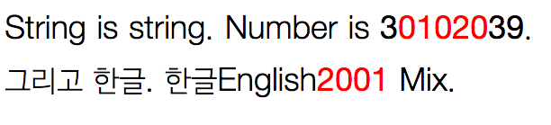

Style Splitter
===



디자이너가 이야기 합니다. "한글은 폰트 이거랑 이런 스타일로, 영문은 이 폰트랑 이런 스타일로..". 개발자는 이야기 합니다. "그렇게는 안됩니다..".

**하지만 이제는 됩니다.**

##How to use

### Basic Use

> var splitter = new StyleSplitter();
> splitter.parse(text);

```javascript
var splitter = new StyleSplitter();
var result = splitter.parse("English 0123456789 그외문자");
console.log(result);
```

위 처럼 사용할 시에 

```html
<span class="ss en">English</span> <span class="ss no">0123456789</span> <span class="ss">그외문자</span>
```

위 내용을 반환합니다. 즉, 자기 설정에 맞춰서 스타일시트를 반영하시면 됩니다. 기본값으로 영어(`en`)와 숫자(`no`)가 설정되어있습니다.

### 추가옵션을 넣고자 하면

> new StyleSplitter(options);

```javascript
var splitter = new StyleSplitter({
	myExtension: /[0-2]/  // 정규표현식을 따릅니다.
});
var result = splitter.parse("English 0123456789 그외문자");
console.log(result);
```

```html
<span class="ss en">English</span> <span class="ss no myExtension">012</span><span class="ss no">3456789</span> <span class="ss">그외문자</span>
```

중간에 자세히 보면 `012` 부분에 `myExtension` 이라는 클래스가 추가 된것을 볼 수 있습니다. 해당 내용을 이용해 스타일 시트를 구성하시면 됩니다.

### 치환문자를 span이외의 태그를 사용하고자 하면

> splitter.wrap = function(styles, contents) { /*...*/ };

```javascript
var splitter = new StyleSplitter();
splitter.wrap = function(styles, contents) {
	if (styles.length === 0 && contents === '') return '';
	if (styles.length === 0) {
		return '<i>' + contents + '</i>';
	}
	return '<i class="' + styles.join(' ') + '">' + contents + '</i>';
};
var result = splitter.parse("English 0123456789 그외문자");
console.log(result);
```

```html
<i class="en">English</i> <i class="no">0123456789</i> <i>그외문자</i>
```

styles에는 현재 사용될 styles리스트가 들어오고 contents에는 해당 본문 내용이 들어옵니다.
	
### 본문전체에 적용되게 하고 싶다면

> splitter.applyAll();

```javascript
	var splitter = new StyleSplitter();
	splitter.applyAll();
```

DOM전체에서 textNode를 검색해서 자동으로 치환해줍니다.


## Todo

- refresh 기능 (SPA 대응.)
